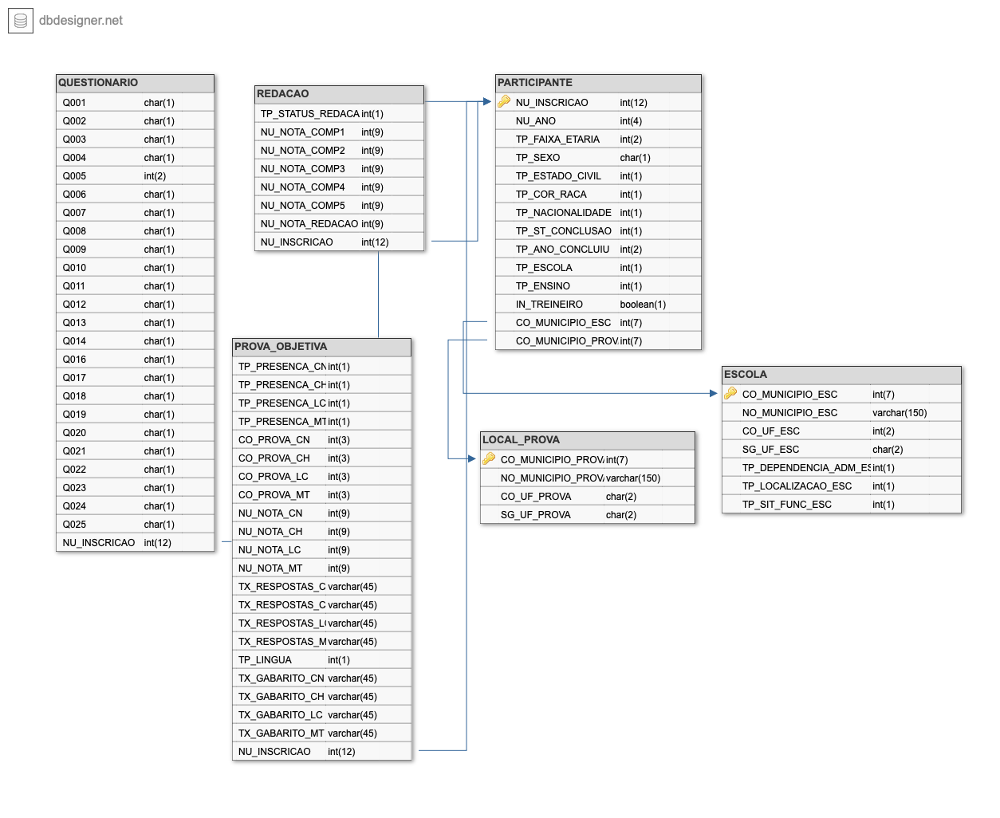

# Teste de Eng. de Dados
Critérios avaliadas:
- Docker;
- SQL;
- Python;
- Organização do Código
- Documentação
- ETL
- Modelagem dos dados

### Steps:

1. Realizar um Fork desse projeto
2. Realizar a modelagem dimensional da base
    - A base está disponível para download [clicando aqui](https://download.inep.gov.br/microdados/microdados_enem_2020.zip).
    - Após descompactar a paste, o Arquivo com a base encontra-se no diretório microdados_enem_2020/DADOS/MICRODADOS_ENEM_2020.csv
    - A documentação necessária sobre os campos da base está disponível nos demais diretórios dentro da pasta descompactada.
3. Realizar o ETL dessa base em Python para o MySQL no container
4. Disponibilizar o link do seu repositório para posterior avaliação

## Solução

### Modelagem dos dados
- Primeiramente foi realizada a modelagem da base de dados na qual temos os informações sobre os seguintes tópicos:
  - Participante
  - Escola
  - Local da prova
  - Prova objetiva
  - Redação
  - Questionário socioeconômico

- A modelagem dos dados ficou da seguinte maneira:

### Docker-compose
- Com a modelagem feita, foi criado então o script para criação das tabelas e seus relacionamentos.
- O docker-compose foi alterado para além do banco de dados, um serviço de visualização na web subisse junto do banco para facilitar na visualização das tabelas. Esse serviço é o Adminer.

### Script Python
- Para manipular os dados foi criado um notebook python.
- Neste notebook, realizei alguns tratamentos na base, como fazer o cast das colunas para que sejam inseridas corretamente no banco, remoção de valores Nulos e divisão da base total em DataFrames distintos relacionados as tabelas as quais eles pertencem.
- A inserção no banco de dados foi realizada utilizando a biblioteca pandas para enviar os dados e a biblioteca sqlalchemy para criar a conexão com o banco.